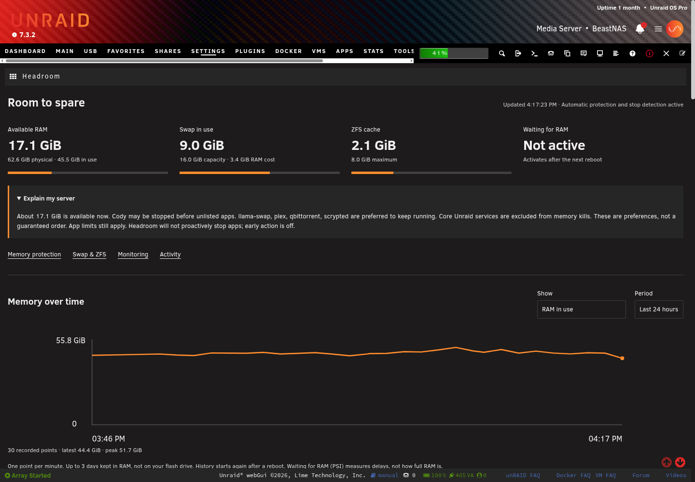
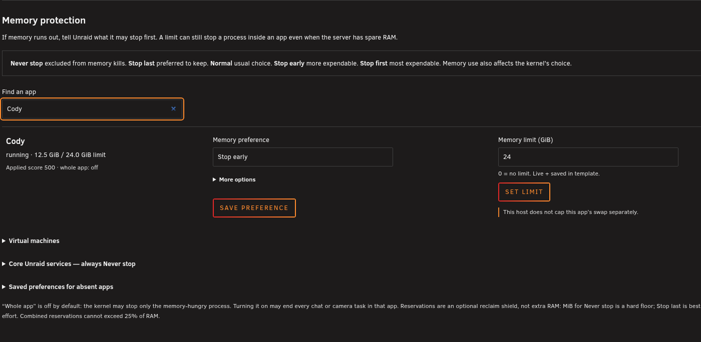
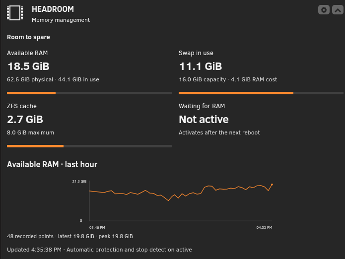
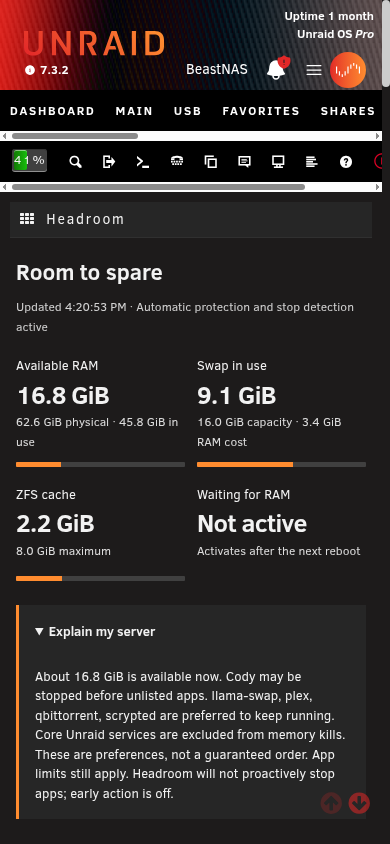
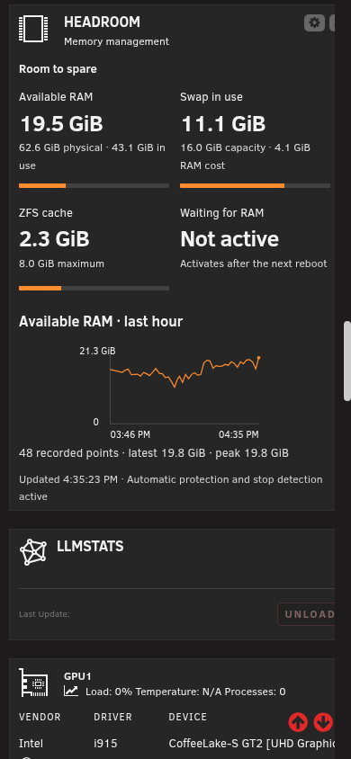

# Headroom

**Memory management for an Unraid server you depend on.** See how much room is left, keep important services protected, and get warned before memory trouble interrupts your apps.

Headroom lives in **Settings → Headroom**, with a tile on the normal Dashboard. It uses Unraid's own light/dark theme, not an embedded application. Requires Unraid 7.x, cgroup v2 and the standard PHP SQLite, POSIX and process-control extensions.

## Screenshots

Actual Unraid 7.3.2 screens, using its native black theme. The same pages follow the active Unraid theme.





<details><summary>Phone views</summary>




</details>

## What it does

- **Memory protection:** choose Never stop, Stop last, Normal, Stop early or Stop first. New and recreated containers are picked up automatically. Core Unraid services stay Never stop. “Stop whole app” is off by default, so one greedy process need not take every task with it.
- **Useful limits, without restarts:** change a container's memory limit live and in its saved Unraid template. A too-tight limit is refused. A limit can still stop a process inside an app even if the host has spare RAM; separate swap caps depend on kernel support.
- **Compressed swap and ZFS cache:** fixed or percentage-based zram size, compression and priorities; guarded resize/refresh; ARC size, target, maximum and hit rate. Existing labelled zram is adopted without draining it.
- **Warnings and history:** available RAM, swap, kernel memory delays (PSI), OOM kills, RAM-backed files and top consumers. Unraid's own notification system delivers alerts. History is one sample per minute for up to 72 hours, capped at 16 MiB in RAM; it resets on reboot, without writing every sample to your flash drive.

“Never stop” means excluded from the kernel's memory-kill choice, **not an absolute uptime guarantee**. Hardware faults, administrator actions and applications' own failures can still stop services. The kernel considers memory use as well as these preferences; this is not a rigid queue.

### Sensible choices for this server

For 64 GB RAM with cameras, Plex, Home Assistant voice and AI workloads:

- 16 GiB zram, zstd, priority 100, swappiness 150.
- Keep the ZFS ARC maximum at **8 GiB**. It gives apps space while retaining a useful file cache.
- **Leave disk swap off.** Every SSD pool here uses ZFS. Swap on ZFS, including a zvol, can deadlock under memory pressure. Headroom only offers directly mounted non-ZFS XFS/ext4 or single-device Btrfs targets; never array disks, USB, network or loop-backed files.
- Cody is Stop early; Plex, qBittorrent, llama-swap and Scrypted are Stop last; unlisted apps are Normal. Core host services are Never stop. These preferences come from migration, not hard-coded app names.

Reservations are optional and initially zero. A Never stop reservation uses a hard reclaim floor; Stop last uses best-effort protection. Parent control groups are configured too, so reservations are effective. Total reservations cannot exceed 25% of physical RAM. Reserving everything would leave the kernel no room to recover.

### Pressure statistics after a reboot

Some Unraid kernels include PSI but disable it by default. Headroom shows **“Activates after the next reboot”**, not made-up zeroes. Its on/off control changes only `psi=` on the **default boot entry's append line**, preserving other entries and parameters. A backup is kept on flash. No reboot is triggered. RAM, swap and memory-kill alerts already work while PSI is unavailable.

Swap evacuation currently requires trustworthy PSI readings as well as enough available RAM. Until PSI is active, refresh, resize or removal that needs evacuation is deliberately refused. Normal operation and legacy adoption do not drain swap.

### Optional early action

Off by default. You must both enable it globally and mark individual containers “Allow early stop.” After sustained pressure, Headroom requests a graceful stop of the most expendable eligible app, then the largest app at that preference. Never stop, Stop last, VMs and core services are excluded. It stops at most one app per pressure episode, waits at least 15 minutes between actions, never force-kills it and does not automatically restart it. If an app ignores its stop request, the activity log says so.

The graceful request explicitly uses SIGTERM, even if an image requests an immediate-kill stop signal. There is no forced-kill deadline.

## Install

In **Plugins → Install Plugin**, paste:

```
https://raw.githubusercontent.com/nphil/headroom/main/headroom.plg
```

Packages are versioned, checksum-verified and cached on flash, so a subsequent boot does not require GitHub to be reachable. No User Scripts entry or change to `/boot/config/go` is needed. The native plugin manager handles updates.

### Moving from ZRAM Compressed Memory

Headroom reads `unraid-zram-card/settings.ini`, carries over zram size/compression/priorities/swappiness and maps the old protection levels:

| Old name | Headroom | Kernel score |
|---|---|---:|
| protected | Never stop | −1000 |
| high | Stop last | −500 |
| normal | Normal | 0 |
| low | Stop early | +500 |
| killfirst | Stop first | +1000 |

Two intentional safety changes: the old global whole-app kill setting becomes **off per container**, and automatic full-cap hard reservations become explicit opt-in reservations. Existing container limits are not changed during migration.

The old plugin, flash configuration and libvirt hook are backed up under `/boot/config/plugins/dockerMan/backup-<date>/`. Headroom applies protection before and after removing the old collector, pages and marked hook. It **does not run the old remover**, because that would drain active swap and clear protection. A live `ZRAM_CARD` device keeps its label and device name; unrelated zram devices are untouched. Migration refuses an enabled legacy disk-swap tier rather than silently adopting unsafe ZFS/loop swap.

If the old plugin moved container processes into a host service's shared protection group, migration repairs their group membership using the container's unique process namespace. It never moves host services or restarts a container.

## Safeguards and storage

Changes are validated and serialized. Existing flash files are backed up before replacement. New memory limits leave at least 10% or 256 MiB above current usage. Swap evacuation needs available RAM for 125% of swapped pages plus the larger of 4 GiB or 10% of physical RAM, with low PSI. Disk swap must leave at least 2 GiB of disk space. An inactive disk-swap file is preserved until explicitly removed.

The monitor follows Docker events and the kernel log, repairs core/VM/container protection every 15 seconds and has a native one-minute watchdog. Libvirt and array lifecycle hooks are installed by the plugin. No broad process-name matching is used across containers. Event and history storage is bounded; no log or history stream goes to flash.

Configuration and recovery values: `/boot/config/plugins/headroom/`. Runtime readings/history: `/tmp/headroom/`. Root and `/tmp` may share a RAM-backed filesystem; their totals must not be added together. Directory footprints exclude nested mounts and are sampled separately at low priority every five minutes.

## Remove or roll back

Use **Plugins → Headroom → Remove**. Headroom refuses if active swap cannot safely return to RAM or an old container limit would be unsafe to restore. On refusal it restarts monitoring/protection and remains installed. Successful removal restores prior limits, ARC and swappiness, restores the owned PSI boot parameter, and removes its hooks/watchdog. Configuration, backups and inactive swap files are retained for recovery.

To return to John White's plugin:

1. Wait for a safe low-pressure window with PSI active, then remove Headroom normally. Do not force a failed removal.
2. Copy the backed-up `settings.ini` from the migration backup's `saved-settings/` into `/boot/config/plugins/unraid-zram-card/settings.ini`.
3. Install `https://raw.githubusercontent.com/johnpwhite/unraid-plg-zram/main/unraid-zram-card.plg` through Plugins → Install Plugin.

The original settings restore its original behavior, including its global whole-app kill option. Review that option before applying. The old plugin also lacks Headroom's Docker-event reapplication. Keep these differences in mind before rolling back.

## Development and releases

Run `nice -n 15 ionice -c3 bash scripts/check.sh` with PHP CLI/XML/SQLite/POSIX/pcntl, Node and ShellCheck installed. Tests cover parsing, migration, protection boundaries, OOM association, pressure episodes, boot-line preservation and swap-evacuation guards. Hardware behavior is verified separately on a real Unraid server; unit tests are not a substitute.

The **Release** GitHub Actions workflow accepts `version` (`YYYY.MM.DD.N`) and plain-text `notes`. It checks the implementation, builds the package, updates the installer/changelog, pushes a version tag and publishes checksum files in a GitHub Release. Release artifacts are immutable. Design and migration rationale: [docs/DESIGN.md](docs/DESIGN.md).

## Credit and license

**Inspired by / based on [unraid-plg-zram by John White](https://github.com/johnpwhite/unraid-plg-zram), used with the author's permission.** Headroom is an independently implemented replacement, with new safety and lifecycle behavior. See [NOTICE](NOTICE). New Headroom code is MIT-licensed; that license does not relicense Unraid or the reference project.
